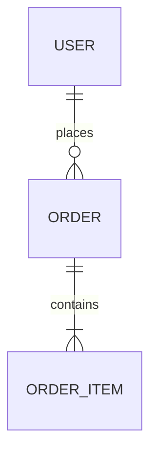
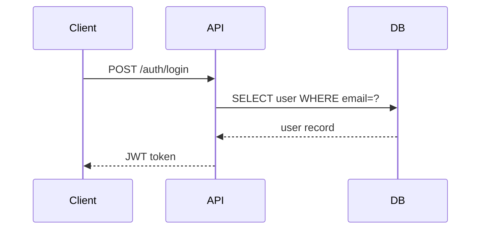

# 프로젝트 산출물 생성기

## 개요

vive-md 방법론 템플릿 라이브러리 기반의 산출물 자동 생성기.
워터폴(초기 개발) 14개 + 칸반(운영) 9개 = 총 23개 산출물 템플릿 보유.

---

## 방법론 선택

### 워터폴 (초기 개발 단계)
```
Phase 0: 기획
Phase 1: 요구사항 분석
Phase 2: 시스템 설계
Phase 3: 상세 설계
Phase 4: 구현 (TDD)
Phase 5: 테스트
Phase 6: 배포
```

### 칸반 (운영/유지보수 단계)
```
배포 완료 후 → 칸반으로 전환
지속적 운영, 인시던트 대응, 기술 부채 관리
```

---

## 산출물 카탈로그

### 워터폴 산출물

| 단계 | 산출물 | 주요 내용 |
|------|--------|----------|
| Phase 0 기획 | 서비스기획서 | 비즈니스 목표, 타겟, 수익 모델 |
| Phase 0 기획 | 비즈니스정책서 | 운영 정책, 규정, 승인 흐름 |
| Phase 1 요구분석 | 요구사항명세서(SRS) | 기능/비기능 요구사항, 제약조건 |
| Phase 1 요구분석 | 유스케이스명세서 | 액터, 시나리오, 예외 흐름 |
| Phase 1 요구분석 | 요구사항추적매트릭스(RTM) | 요구사항-설계-테스트 매핑 |
| Phase 2 시스템설계 | 시스템아키텍처설계서(SAD) | 전체 구조, 컴포넌트, 인터페이스 |
| Phase 2 시스템설계 | 데이터베이스설계서 | ERD, 테이블 정의, 인덱스 전략 |
| Phase 2 시스템설계 | API설계서 | RESTful API 명세, 인증, 에러코드 |
| Phase 2 시스템설계 | 화면설계서 | UI 흐름, 와이어프레임, 상태 정의 |
| Phase 3 상세설계 | 상세설계서 | 클래스 다이어그램, 시퀀스, 알고리즘 |
| Phase 5 테스트 | 테스트계획서 | 테스트 전략, 범위, 일정 |
| Phase 5 테스트 | 테스트케이스 | 기능별 테스트 케이스, 예상 결과 |
| Phase 5 테스트 | 테스트결과보고서 | 실행 결과, 결함 목록, 조치 내역 |
| Phase 6 배포 | 배포계획서 | 배포 절차, 롤백 계획, 체크리스트 |

### 칸반 산출물

| 산출물 | 주요 내용 |
|--------|----------|
| 칸반보드설계서 | WIP 한도, Swimlane, Class of Service |
| 서비스수준협약(SLA) | 가용성, 응답시간, 장애등급별 대응시간 |
| 변경요청관리프로세스 | CR 프로세스, 승인 체계, 칸반 연동 |
| 장애대응절차서 | 장애 분류, Runbook, Post-mortem 템플릿 |
| 기술부채관리대장 | 부채 분류, 등록, 해소 전략 |
| 릴리스관리절차서 | 정기/긴급/핫픽스, 롤백 절차 |
| 운영모니터링대시보드 | 시스템/앱/비즈니스 메트릭 설계 |
| 회고및개선보고서 | KPT, 칸반 4가지 리뷰, 개선 추적 |
| 인수인계문서 | 시스템 구성, 운영 정보, KT 계획 |

---

## 산출물 생성 워크플로우

### 1단계: 프로젝트 정보 수집

사용자에게 확인할 것:
- [ ] 프로젝트명 / 서비스명
- [ ] 현재 단계 (워터폴 Phase 몇? 또는 칸반 운영 중?)
- [ ] 기술 스택 (React, Spring Boot, PostgreSQL 등)
- [ ] 팀 규모 / 조직 구조
- [ ] 생성할 산출물 선택

### 2단계: 템플릿 기반 생성

- `[placeholder]` 표시된 항목을 프로젝트 정보로 채운다
- Mermaid 다이어그램 포함 (flowchart, ERD, sequenceDiagram, gantt)
- 한국어로 작성, 기술 용어는 영문 유지

### 3단계: 검토 및 조정

생성 후 사용자에게 확인:
- 내용이 실제 프로젝트와 일치하는가?
- 추가/수정할 항목이 있는가?
- 다음 단계 산출물도 필요한가?

---

## 다이어그램 표준





---

## 자주 쓰는 산출물 빠른 생성

요청 예시 → 생성 산출물:
- "API 명세서 만들어줘" → API설계서 (RESTful, OpenAPI 3.0 형식)
- "DB 설계해줘" → 데이터베이스설계서 (ERD + 테이블 정의)
- "장애 났을 때 어떻게 해?" → 장애대응절차서 (Runbook 포함)
- "배포 체크리스트 만들어줘" → 배포계획서 (롤백 포함)
- "테스트 케이스 작성해줘" → 테스트케이스 (Given-When-Then 형식)
